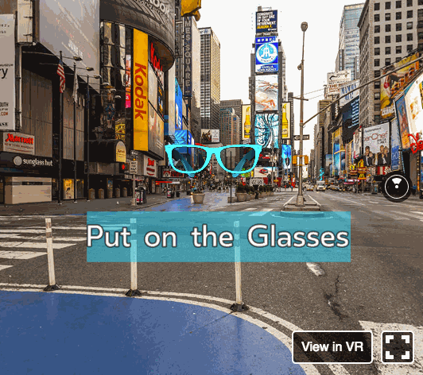

# [Put on the Glasses! VR](https://radvalentin.github.io/put-on-the-glasses-vr/)

[](https://greenkeeper.io/)

Intro slide for my talk on ReactVR held at [React.js Bucharest Meetup](https://www.meetup.com/react-bucharest/) on April 11 2017

[](https://radvalentin.github.io/put-on-the-glasses-vr/)

Rest of the slides can be found here: [React VR 101](https://docs.google.com/presentation/d/1_ookC72csAi3UixYIsd9wxGZW83B1gTMntvNZVcAjy8/edit?usp=sharing)

## How to run it

```
npm start
```

If it gets stuck at `Loading dependency graph, done.` make sure to reload the page for `http://localhost:8081/vr/?hotreload`.

## Assets used

[360 Times Square pano](https://goo.gl/maps/uPEC9vw4KK72) from Panedia

[Raybanz model](http://tf3dm.com/3d-model/raybanz-sunglasses-50410.html) by Hazzbberry

## Video (Romanian Language)

[](https://www.youtube.com/watch?v=v_tAxOD2ZsE)
